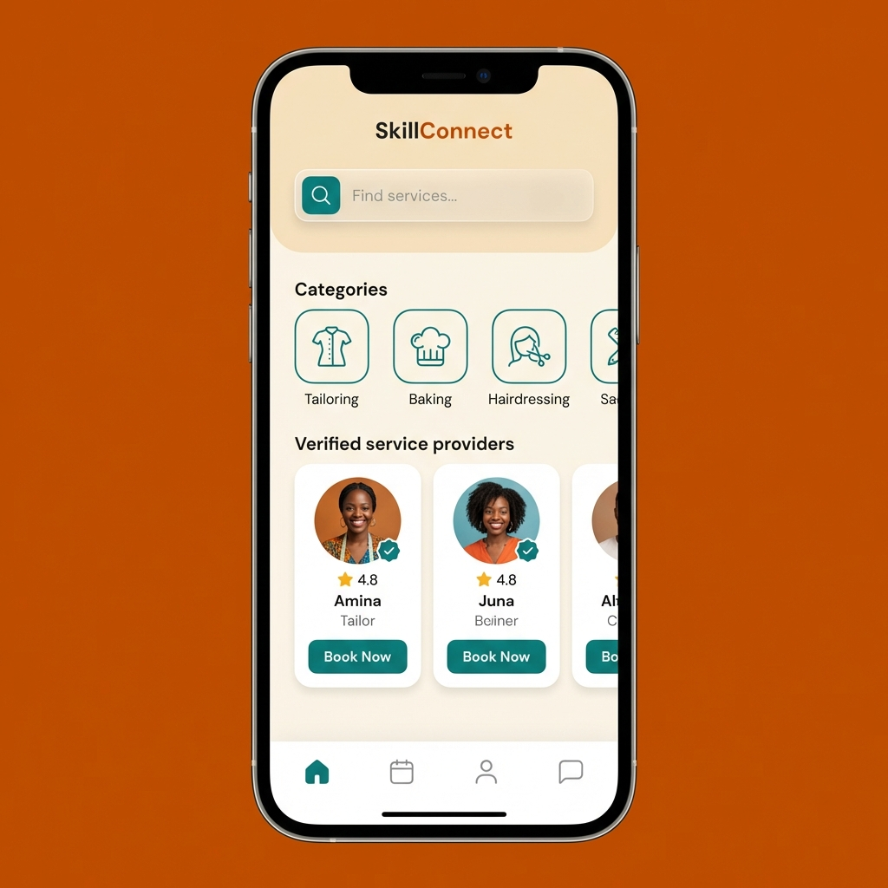
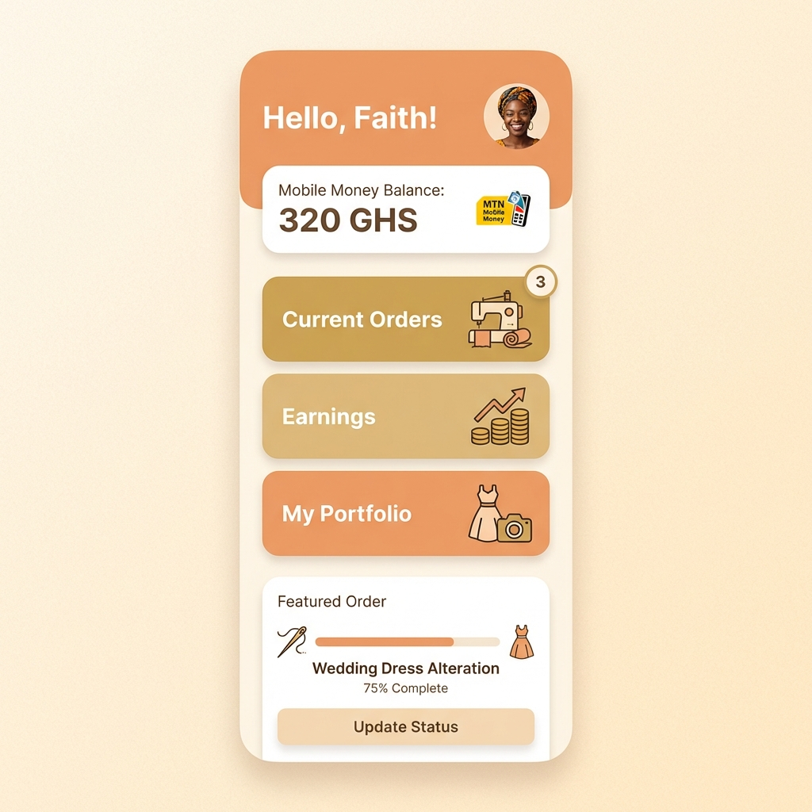

# SkillConnect

SkillConnect is a Flutter + Firebase mobile application that connects local service providers (tailors, bakers, hair stylists, and more) with clients in their area. Clients can browse verified providers, book services, and track their bookings in real time. Providers get a personal dashboard to manage orders and monitor earnings.

---

## Screenshots

| Home Screen | Provider Dashboard |
|---|---|
|  |  |

---

## Features

**Client Side**
- Home screen with service categories and verified provider listings
- Search and filter providers by category
- Detailed provider profiles with ratings and portfolio
- Booking flow with deposit simulation (Mobile Money)
- SharedPreferences: dark mode toggle and last search query persistence

**Provider Side**
- Personal dashboard showing balance and total earnings
- Order and booking management
- Portfolio management

**Backend**
- Firebase Authentication: Email/Password sign-in, registration, and password reset
- Cloud Firestore: real-time CRUD operations across `users`, `providers`, and `bookings`
- Firebase Security Rules protecting data access by user ownership

---

## Architecture

The app follows **Flutter Clean Architecture** for clear separation of concerns:
```
lib/
├── data/           # Repository implementations, Firebase data sources
├── domain/         # Business entities and repository interfaces
├── presentation/   # UI pages, BLoC state management
│   ├── blocs/      # AuthBloc, ProviderBloc, SettingsBloc
│   └── pages/      # All screen widgets
├── injection_container.dart   # Dependency injection setup
└── main.dart
```

State management uses the **BLoC pattern** (via `flutter_bloc`). Business logic never sits inside UI widgets; all state changes flow through events and states.

---

## Getting Started

### Prerequisites

- Flutter SDK `>=3.1.0` ([install guide](https://docs.flutter.dev/get-started/install))
- A Firebase account ([console](https://console.firebase.google.com/))
- Android emulator or physical device (Android 6.0+)

### Setup Instructions

**1. Clone the repository**
```bash
git clone https://github.com/Karabo-jpg/SkillsConnect.git
cd SkillsConnect
```

**2. Install dependencies**
```bash
flutter pub get
```

**3. Configure Firebase**

- Go to the [Firebase Console](https://console.firebase.google.com/) and create a new project.
- Register an **Android** app with package name `com.example.skillconnect`.
- Download `google-services.json` and place it in `android/app/`.
- For iOS, download `GoogleService-Info.plist` and place it in `ios/Runner/`.
- Enable **Email/Password** under Authentication > Sign-in method.
- Create a **Firestore Database** and copy `firestore.rules` into your Security Rules tab.

**4. Run the app**
```bash
flutter run
```

> Run on a physical device or emulator only. Web and desktop builds are not supported.

---

## Testing
```bash
flutter test
```

- **Unit tests** (`test/unit_test.dart`): model serialization and business logic
- **Widget tests** (`test/widget_test.dart`): UI component rendering verification

---

## Firestore Collections

| Collection | Key Fields |
|---|---|
| `users` | `uid`, `email`, `displayName`, `userType`, `createdAt` |
| `providers` | `uid`, `businessName`, `category`, `hourlyRate`, `rating`, `totalEarnings` |
| `bookings` | `bid`, `clientId`, `providerId`, `serviceName`, `status`, `depositAmount`, `scheduledDate`, `createdAt` |

---

## Firebase Security Rules

Security rules are defined in `firestore.rules`:
- Users can only read and write their own profile document.
- Provider profiles are readable by all authenticated users, writable only by the provider.
- Bookings are accessible only to the client or provider involved.

---

## Contributing

1. Create a feature branch: `git checkout -b your-name-feature`
2. Make changes and test on your emulator.
3. Commit with a clear message and open a Pull Request.

---

*Developed as a Final Project for Mobile Application Development.*